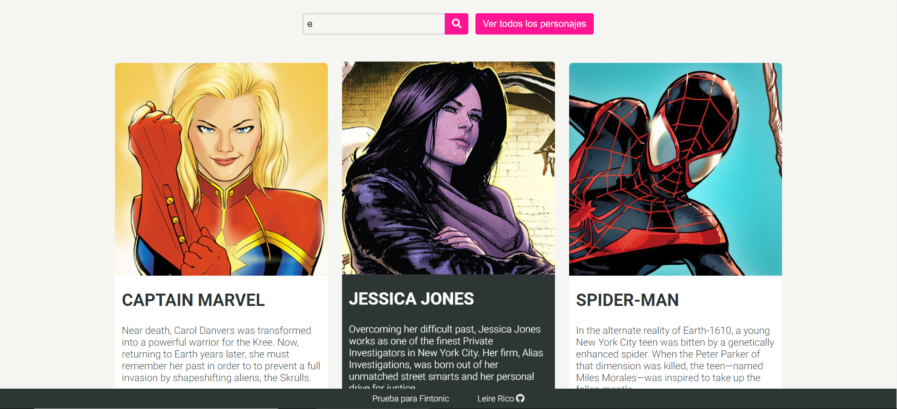

# BUSCADOR DE PERSONAJES DE MARVEL



Enlace a la app --> https://leireriel.github.io/marvel-searcher_react/#/

## 🤖 ¿Qué es esto?
Es una SPA (Single Page Application) creada con **React JS** para buscar personajes de la [API de Marvel](https://developer.marvel.com/). También se puede ver el detalle del personaje seleccionado, que contiene información adicional.

## 👀 ¡Nota importante!
El servidor de Marvel estuvo caído durante los días en los que hice la prueba, y la API funcionaba mal. Por este motivo decidí mockear un json con algunos personajes. El mock está incluido en este repositorio (src/services).

## 🏗 Getting Started
Es necesario tener instalado [Node.js](https://nodejs.org/), y después:
1. `$ git clone https://github.com/leireriel/marvel-searcher_react.git` para clonar el repositorio
2. `$ npm install` para instalar las dependencias
3. `$ npm start` para arrancar la app en el navegador 

## ⛩ Estructura y componentes
```
|_src
  |_App

  |_services
    |_fetchCharacters
    |_mockCharacters.json

  |_components
    |_FetchCharacters
    |_Filters
      |_FilteredCharacter
    |_Search
    |_CharacterList
    |_CharacterDetail
      |_NavDetail
      |_PaintDetail
    |_Contact
  
  |_styles
    |_core
      |_variables
      |_mixins

  |_images
```

## 💪 Retos y soluciones
Durante el tiempo que he dedicado a hacer este proyecto, he aprendido muchas cosas.

Hasta ahora estaba acostumbrada a usar un estado global, pero esta semana aprendí la utilidad de controlar los **estados en cada componente** para evitar la sobrecarga del componente madre.

En este proyecto hay **dos rutas**:
1. La home (que contiene el listado de personajes y el buscador)
2. La vista de detalle (que se genera dinámicamente con el id del personaje sobre el que haces click).

Como dentro de cada ruta se hace un fetch diferente, me pareció una buena idea probar a hacer estados locales para cada ruta. En la primera se almacena el array de personajes y en la segunda el personaje para ver en detalle.

También ha sido la primera vez que hago peticiones a una API usando **autenticación**, y la primera vez que hago un **mock** y un **fetch a un json almacenado en local**.

## 🗂 Dependencias
* [react](https://www.npmjs.com/package/react) - Librería de JavaScript usada en el proyecto ⚛ 
* [react-router-dom](https://www.npmjs.com/package/react-router-dom) - Para las rutas
* [prop-types](https://www.npmjs.com/package/prop-types) - Para verificar el tipado de las props
* [node-sass](https://www.npmjs.com/package/node-sass) - Para usar SCSS

## 👩🏼‍💻 Qué tecnologías he usado
API
* [Postman](https://www.getpostman.com/) me ha ayudado con las peticiones a la API

Programación (JS / React)
* Uso de algunos métodos de **ciclos de vida** para los componentes de React
* Uso de **React Router** para simular la navegación por páginas
* Uso de **React PropTypes**

Maquetación
* **SASS**
* **Variables, mixins, animaciones y transiciones**
* Diseño **responsive** 
* **Mobile First**
* **Flexbox**
* Uso de **BEM** para el nombrado de clases

## 💡 To Do
1. **Controlar mejor el rendering**. Renderizar la lista de personajes del componente CharacterList solo al hacer click en el botón de búsqueda. Creo que estoy teniendo algún problema de *asincronía* con el estado cuando hago click en este botón. Al usar el método shouldComponentUpdate recibo una doble respuesta y creo que está interfiriendo de alguna forma con el estado.
2. Conseguir que se pueda **clickar el botón "Ver todos los personajes" desde el principio**. Sólo funciona si has presionado antes el botón de búsqueda que acompaña al input.
3. Mejorar la **organización de componentes** para la primera ruta (incluye los componentes FetchCharacters, FilteredCharacter, Search y CharacterList). Creo que la arquitectura sería más legible si todos los componentes de esta primera ruta estuvieran organizados en jerarquía, uno dentro de otro, según van siendo requeridos. A pesar de esto me he decidido a dejarlos en el mismo nivel porque creo que la estructura se complicada innecesariamente encapsulándolos todos uno dentro de otro. Tengo que documentarme más sobre estrategias para organizar componentes.
4. ¡Hacer por fin el **fetch a la API de Marvel**!.
5. Idea: evento para cambiar el scroll por defecto (vertical) a **Scroll horizontal** para ver la lista de personajes de la primera ruta. Tendría que poner "flex-wrap: nowrap".

## 🎨 Attribution
* Las imágenes de los personajes son de la [web de Marvel](https://www.marvel.com/explore).
* El favicon es de [IconArchive](http://www.iconarchive.com/show/ultrabuuf-icons-by-mattahan/Comics-Spiderwoman-icon.html).

# 🤜🤛 Sugerencias
Todas las sugerencias son bienvenidas, puedes abrir una issue :)

Gracias 💜
